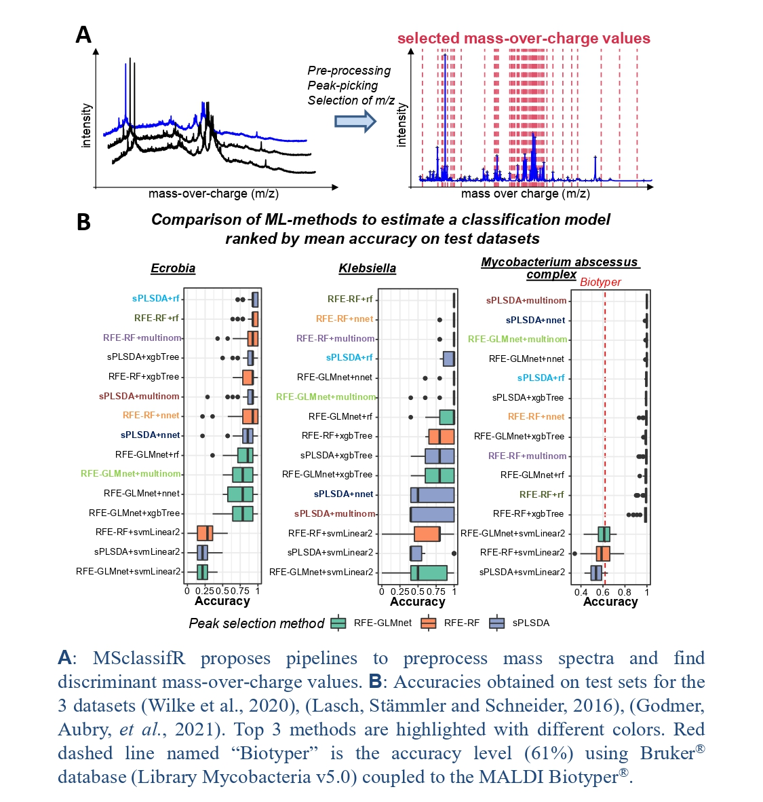

# MSclassifR: an R Package for Supervised Classification of Mass Spectra with Machine Learning Methods
[](https://cran.r-project.org/web/packages/MSclassifR/index.html)
[](https://cran.r-project.org/web/packages/MSclassifR/index.html)
[](https://cran.r-project.org/web/checks/check_results_MSclassifR.html)
[](https://www.gnu.org/licenses/gpl-3.0)
 

<p align="center">
  
</p>

## 1. Description:

This package provides R functions to classify mass spectra in known categories, and to determine discriminant mass-over-charge values. It was developed with the aim of identifying very similar species or phenotypes of bacteria from  mass spectra obtained by Matrix Assisted Laser Desorption Ionisation - Time Of Flight Mass Spectrometry (MALDI-TOF MS). However, the different functions of this package can also be used to classify other categories associated to mass spectra; or from mass spectra obtained with other mass spectrometry techniques. It includes easy-to-use functions for pre-processing mass spectra, functions to determine discriminant mass-over-charge values (m/z) from a library of mass spectra corresponding to different categories, and functions to predict the category (species, phenotypes, etc.) associated to a mass spectrum from a list of selected mass-over-charge values. 
<p align="center">
  
</p>


[](https://doi.org/10.1101/2022.03.14.484252)

## 2. Installation:

The installation of the `MSclassifR` package requires the installation of packages from `Bioconductor`, so you you might have to install the latest version of the `BiocManager` package. The `MSclassifR` package imports the other necessary packages from the CRAN. In addition, it is recommended to install the latest version of R.

```
## install BiocManager if not installed
if (!require("BiocManager", quietly = TRUE))
            install.packages("BiocManager")

## Install the mixOmics and multtest packages from Bioconductor
BiocManager::install(c("multtest","mixOmics", "limma", "qvalue", "cp4p"))

## Install MSclassifR package
install.packages("MSclassifR")

## Check after install the `MSclassifR` package:
require(MSclassifR) ## For spectral easy signal processing and machine learning
```
## 3. Vignettes and examples:

Three vignettes illustrating how to use the functions of this package from real data sets are also available online to help users: 
- [*Ecrobia* sp.](https://agodmer.github.io/MSclassifR_examples/Vignettes/Vignettemsclassifr_Ecrobiav3.html)
- [*Klebsiella* sp.](https://agodmer.github.io/MSclassifR_examples/Vignettes/Vignettemsclassifr_Klebsiellav3.html)
- [Differential analysis of omics data](https://agodmer.github.io/MSclassifR_examples/Vignettes/Vignettemsclassifr_DAv3.html)


### Download the MSclassifR package: [link](https://cran.r-project.org/web/packages/MSclassifR/index.html)
