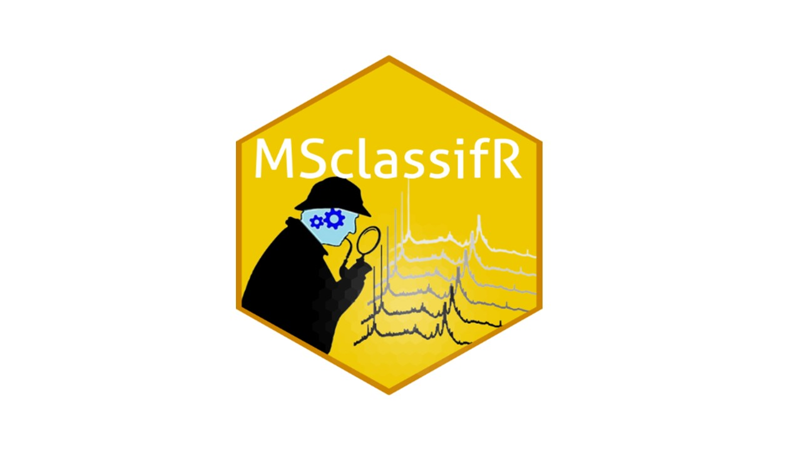
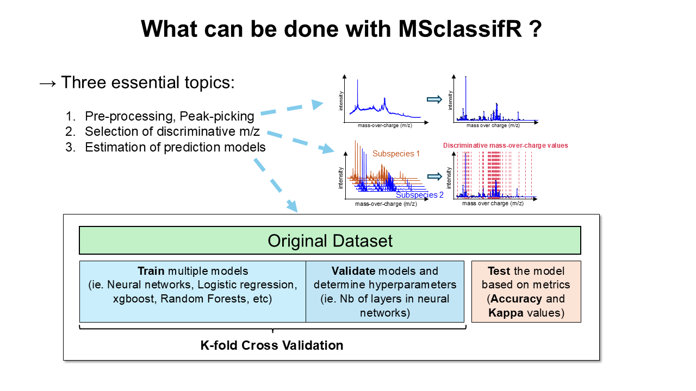
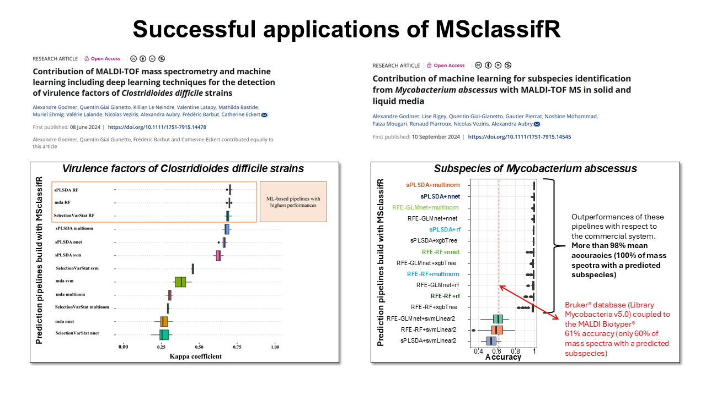
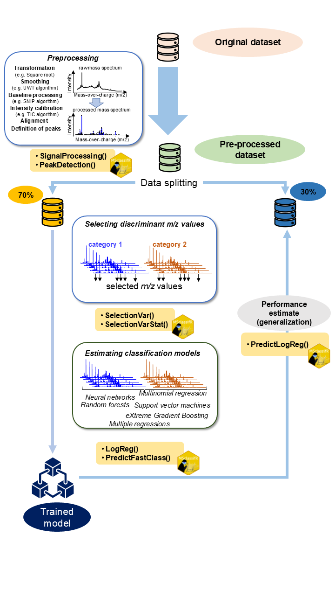

<h1 align="center">MSclassifR: an R Package for Supervised Classification of Mass Spectra with Machine Learning Methods</h1>

<div align="center" style="margin-top: 10px;">
  <a href="https://cran.r-project.org/web/packages/MSclassifR/index.html"></a>
   <a href="https://cran.r-project.org/package=MSclassifR">  </a>
  <a href="https://cran.r-project.org/web/packages/MSclassifR/index.html"></a>
  <a href="https://cran.r-project.org/web/checks/check_results_MSclassifR.html"></a>
  <a href="https://www.gnu.org/licenses/gpl-3.0"></a>
  <a href="https://doi.org/10.1016/j.eswa.2025.128796">
    
</div></a>
  
<p align="center" style="max-width: 100%; max-height: 100%;">
  
</p>

## 1. Description

This package provides R functions to classify mass spectra in known categories, and to determine discriminant mass-to-charge values. It was developed with the aim of identifying very similar species or phenotypes of bacteria from  mass spectra obtained by Matrix Assisted Laser Desorption Ionisation - Time Of Flight Mass Spectrometry (MALDI-TOF MS). However, the different functions of this package can also be used to classify other categories associated to mass spectra; or from mass spectra obtained with other mass spectrometry techniques. It includes easy-to-use functions for pre-processing mass spectra, functions to determine discriminant mass-to-charge values (m/z) from a library of mass spectra corresponding to different categories, and functions to predict the category (species, phenotypes, etc.) associated to a mass spectrum from a list of selected mass-to-charge values. If you use this package in your research, please cite the associated publication [available here](https://doi.org/10.1016/j.eswa.2025.128796).

<p align="center">
  
</p>

<p align="center">
  
</p>

## 2. Installation

The installation of the `MSclassifR` package requires the installation of packages from `Bioconductor`, so you you might have to install the latest version of the `BiocManager` package. The `MSclassifR` package imports the other necessary packages from the CRAN. In addition, it is recommended to install the latest version of R.

```
## install BiocManager if not installed
if (!require("BiocManager", quietly = TRUE))
            install.packages("BiocManager")

## Install the mixOmics and multtest packages from Bioconductor
BiocManager::install(c("multtest","mixOmics", "limma", "qvalue", "cp4p"))

## Install MSclassifR package
install.packages("MSclassifR")

## Check after install the `MSclassifR` package:
require(MSclassifR) ## For spectral easy signal processing and machine learning
```

## 3. Your Guide to MSclassifR: step-by-step examples and case studies
- **Understanding the basics:** [a brief introduction concerning machine learning](Documents/ML_intro.md)
  
- **Exploring MSclassifR:** [a comprehensive overview of a user-friendly tool for mass spectrometry classification](Documents/MSclassifR_summary.md)
  
- **Hands-on examples:** three vignettes illustrating how to use the functions of this package from real data sets are also available online to help users: 
  - [*Ecrobia* sp.](https://agodmer.github.io/MSclassifR_examples/Vignettes/Vignettemsclassifr_Ecrobiav3.html)
  - [*Klebsiella* sp.](https://agodmer.github.io/MSclassifR_examples/Vignettes/Vignettemsclassifr_Klebsiellav3.html)
  - [differential analysis of omics data](https://agodmer.github.io/MSclassifR_examples/Vignettes/Vignettemsclassifr_DAv3.html)
    
- **Delve deeper into MSclassifR:** [article](https://doi.org/10.1016/j.eswa.2025.128796)
  
- **Code and reproducibility resources:**
    - codes used for the experiments, including scripts, workflows, and configuration files, is publicly available and versioned at this [link](Experiments/README.md)
    - the computing environment is specified using a [sessionInfo()](Experiments/SessionInfo.txt) output to ensure reproducibility.
    - input datasets, when not proprietary, are included or clearly referenced in the repository.
      
- **If you use MSclassifR or any of the code/workflows from this repository, please cite the following article:**

Godmer, A., Benzerara, Y., Varon, E., Veziris, N., Druart, K., Mozet, R., Matondo, M., Aubry, A., & Giai Gianetto, Q. (2025).
MSclassifR: An R package for supervised classification of mass spectra with machine learning methods.
Expert Systems with Applications, 294, 128796. https://doi.org/10.1016/j.eswa.2025.128796

### 🗨️ Questions or suggestions? We welcome your feedback! Join the discussion on our [forum](https://github.com/agodmer/MSclassifR_examples/discussions).

## 4. Practical workflow using MSclassifR

<p align="center" style="max-width: 100%; max-height: 100%;">
  
</p>

---
